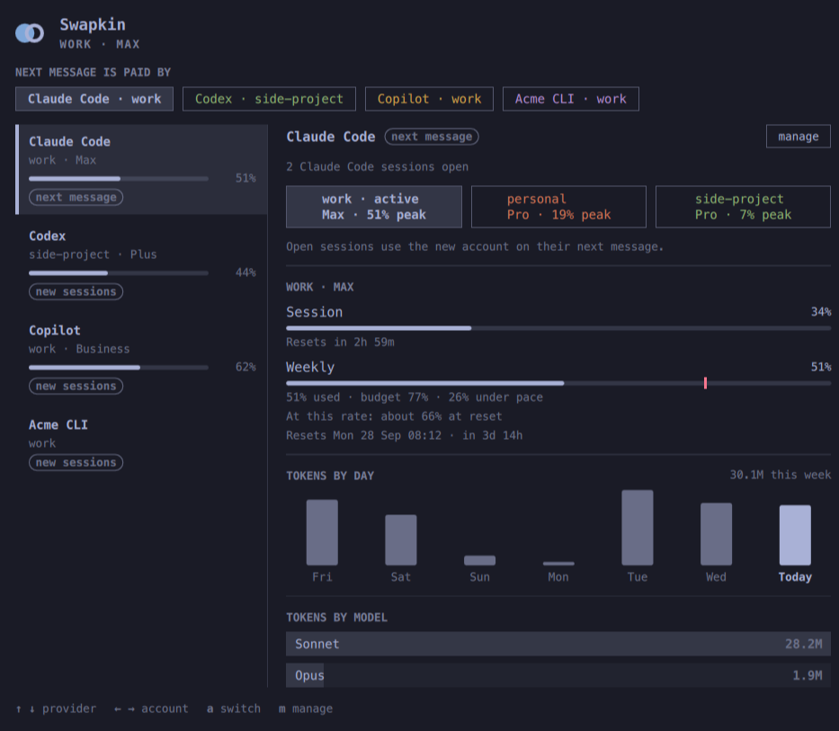

# Swapkin

Switch between several Claude Code accounts from the Omarchy bar, without
re-logging in and without losing your sessions.

One shared config directory stays where it is. A switch swaps the login inside
it, so settings, sessions, skills, hooks and MCP logins are untouched, and the
Claude Code windows you already have open follow the new account on their next
message.



## What it does

- **A wide popover with two columns.** Providers on the left, the one you picked
  on the right, and a "next message is paid by" strip on top. On a screen tall
  enough it never scrolls; on a shorter one the columns scroll inside it.
- **Switch accounts from the bar.** Every account is a card. Move over one to
  preview its limits, then switch. Keys: `↑` `↓` provider, `←` `→` account,
  `a` switch, `m` manage, `r` refresh.
- **Each account keeps its own colour**, shown in the bar icon, the account list
  and, if you want it, the Claude Code status line.
- **Limits for every account**, not only the active one: session window, weekly
  window and any model-specific window the plan has.
- **Pace, not just a percentage.** `13% used · budget 20% · 7% under pace`,
  `At this rate: about 64% at reset`, and the reset time. The budget grows only
  during the days and hours you work (see below).
- **A watchdog while the panel is closed.** It warns once when the active
  account passes your threshold. Hand-over when an account is spent is opt-in.
- **Today's tokens at API prices**, as an estimate you can sanity-check.

## Requirements

- Omarchy with the shell plugin system (`omarchy plugin --help` works)
- `claude` (Claude Code), `jq`, and `notify-send` for the warnings

## Install

```bash
omarchy plugin add https://github.com/sirallap/omarchy-swapkin --enable
```

The widget replaces Omarchy's built-in Agents widget in the bar. To go back:

```bash
omarchy plugin remove io.github.sirallap.swapkin
```

## First run

Open the panel, press **manage**, then **+ add account**.

The first account is whoever is signed in right now — nothing to type. Every
account after that opens Claude Code in a throwaway config folder; run `/login`
and Swapkin saves the account and closes the window by itself. Your usual config
is never touched by that sign-in.

From a terminal, the same thing:

```bash
swapkin add work        # or just: swapkin add
swapkin use personal
swapkin list
```

## How switching works

Claude Code keeps its login in `.credentials.json` and the account profile in
`.claude.json`. Swapkin swaps only those two things:

| Swapped with the account | Left alone |
| --- | --- |
| `claudeAiOauth` in `.credentials.json` | `mcpOAuth` (Slack, Figma, …) |
| The account keys in `.claude.json`: profile, user id, model access, org defaults, extra-usage state | Projects, history, onboarding, machine ids, settings, skills, hooks |

Two details that matter:

- **Open sessions notice.** Claude Code re-reads the credentials file when its
  modification time changes, so a running session picks the new account up on
  its next request. Connectors may keep the old account until that session is
  restarted.
- **Refresh tokens rotate.** Every switch writes the live login back to its own
  profile first, so a stored login is never the stale half of a rotation.

## Commands

| Command | What it does |
| --- | --- |
| `swapkin status` | The active account and its plan |
| `swapkin list [--json]` | Saved accounts; `*` marks the active one |
| `swapkin add [name]` | Save a new account (the first is your current login) |
| `swapkin use <name>` | Switch every Claude Code session to that account |
| `swapkin colour <name> <#rrggbb>` | Set the colour that marks an account |
| `swapkin remove <name>` | Forget a saved account |
| `swapkin usage` | Refresh each account's limits |
| `swapkin check` | One watchdog pass: refresh, warn, hand over |
| `swapkin cost` | Today's tokens priced at API rates, as JSON |
| `swapkin statusline [--plain]` | The active account, coloured, for a status line |

## Settings

Behaviour lives in `~/.local/share/swapkin/config.json`:

```json
{ "alertAt": 90, "autoSwitch": false }
```

- `alertAt` — the weekly percentage that triggers one desktop warning per window.
- `autoSwitch` — off by default. Turn it on and a spent account hands over to the
  account with the most room left, with a notification saying so. Left off, you
  get the warning and decide yourself.

The watchdog interval and the weekly budget are widget settings:

```bash
omarchy bar set io.github.sirallap.swapkin watchIntervalMin 5 --json
```

`budgetSpread` (`Working days` or `Every day`), `budgetDays` (`Mon,Tue,Wed,Thu,Fri`),
`budgetStartHour` (9) and `budgetEndHour` (19) shape the pace curve: only those
hours earn weekly budget. With no working day picked, or an end hour that is not
after the start, the budget grows evenly all week.

`prices.json`, next to the plugin, holds the per-million-token rates used for the
"at API prices" line. They change; edit the file rather than the code.

## Where things live

```
~/.local/share/swapkin/
  active                  the account in use
  config.json             alertAt, autoSwitch
  <account>/oauth.json    that account's login        (0600)
  <account>/account.json  its profile keys            (0600)
  <account>/meta.json     its colour
  <account>/usage.json    its last good limits
```

Logins are readable only by you. They never leave the machine: Swapkin talks to
the same Anthropic usage endpoint Claude Code already uses, one account at a
time, from that account's own saved login.

## Status line

Claude Code's status line is yours, so Swapkin does not touch it. It does print
a ready-made segment — the active account, in that account's colour:

```bash
swapkin statusline            # coloured, for a terminal
swapkin statusline --plain    # just @work
```

Add it to the script behind `statusLine` in your Claude Code settings:

```bash
printf '\n'; swapkin statusline
```

A line of its own survives a narrow or split pane, where a long first line is
cut off.

## Limitations

- Claude Code only. The name is deliberately generic: another CLI with the same
  shape of login could be added later.
- Token history is machine-wide, not per account — the session files do not
  record which account paid for them. Limits *are* per account.
- An idle account's figures are only as fresh as its login: when its token
  expires, the panel keeps the last good numbers and says how old they are.
- Switching touches undocumented internals of Claude Code's config. It has
  worked since day one here, but a future release could move things.

## Licence

MIT. Parts of the panel are derived from Omarchy's built-in agents plugin,
also MIT. Claude and Claude Code are trademarks of Anthropic; this is an
independent project and is not affiliated with or endorsed by Anthropic.
